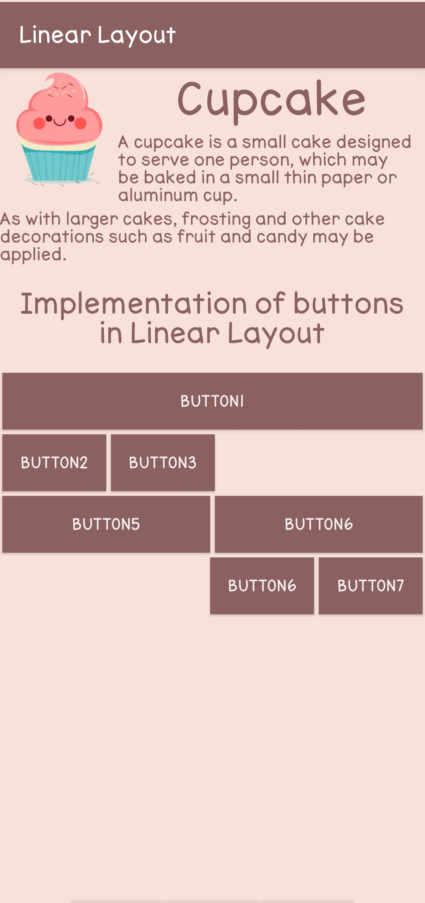
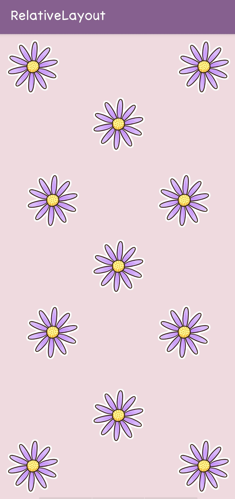

# Layout

Layout adalah penyusunan dari elemen-elemen desain yang berhubungan kedalam sebuah bidang sehingga membentuk susunan artistik. Hal ini bisa juga disebut manajemen bentuk dan bidang. Tujuan utama layout adalah menampilkan elemen gambar dan teks agar menjadi komunikatif dalam sebuah cara yang dapat memudahkan pembaca menerima informasi yang disajikan.

# 1.	Linear Layout

Linear Layout adalah jenis layout yang paling simple dimana user menempatkan 1 objek per baris atau kolom secara sejajar. Jadi di dalam setiap baris atau kolom hanya ada 1 objek yang bisa ditempatkan . Linear Layout ada dua jenis yaitu :

•	Linear Layout Vertical (Objek per baris/kesamping) 

•	Linear Layout Horizontal (Objek per kolom/kebawah).

Contoh hasil Linear Layout :

 
 
# 2.	Relative Layout

Relative Layout adalah jenis layout yang memiliki karakteristik dalam menempatkan view secara relatif yaitu posisi pada tiap view bergantung kepada view yang lain. Jadi, kita bebas untuk menempatkan objek yang diinginkan sesuka hati kita. Penempatan satu objek bisa dimana saja mau di sisi kanan, kiri, atas, ataupun bawah dari objek lain. Jika tidak di tetapkan, maka objek dapat menumpuk antara satu objek dengan objek yang lain.

Contoh hasil Relative Layout :

# 3.	Constraint Layout
Constarint Layout memungkinkan kita membuat tata letak yang besar dan kompleks dengan tampilan datar. Ini hampir mirip dengan Relative Layout karena semua tampilan ditata berdasarkan hubungan antara satu objek dengan yang lain, tetapi lebih fleksibel daripada RelativeLayout dan lebih mudah digunakan dengan Editor Layout Android Studio.

Selengkapnya bisa dilihat [disini](https://darmanto.akakom.ac.id/praktikandroid/Modul%203%20Praktikum%20Pemrograman%20Mobile.pdf)

# Kesimpulan :
Dari ketiga layout tersebut maka kita bisa mengambil kesimpulan bahwa setiap layout memiliki keunggulan dan kekurangan masing-masing, linear layout bisa mengikuti ukuran layar handphone yang berbeda-beda tanpa merubah susuan objek, relative layout hanya akan terlihat sesuai dengan apa yang telah ditetapkan sebelumnya jika ukuran layar berubah bisa saja objek ada yang terpotong atau bahkan tidak terlihat, sedangkan constraint layout itu lebih flexible dan mudah untuk dibuat.

# Activity :

Activity merupakan public class dalam aplikasi android. Dalam satu activity pasti memiliki dua metode berikut :

1. onCreate Untuk menginisiasi suatu activity, biasanya dipanggil dengan perintah setContentCiew(int) untuk resource yang didefinisikan di layout UI, dengan perintah findViewById(int) untuk memanggil widget yang dibutuhkan UI untuk berinteraksi dengan aplikasi. 

2. onPause Untuk menyatakan ketika user meninggalkan suatu activity. Untuk penggunaan dengan Context.StartActivity(), semua kelas activity harus sesuai dengan yang dideklarasikan dalam suatu paket di AndroidManifest.xml. Activity adalah bagian penting dari model aplikasi.

